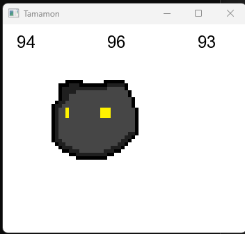
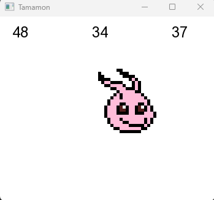

# Table of Contents
1. [Description](#Description)
2. [Install and Run the Project](#Install-and-Run-the-Project)
3. [How to play](#How-to-play)
3. [Technologies](#Technologies)
3. [Features](#Features)

# Tamamon - Digimon tamagotchi fuse

## Description
This is a simple program written in C++ along with SFML media library. This game is an emulation of the classic tamagotchi but with a twist, the charcters featured are from the popular japanese anime "Digimon".
I'm making this project simply for fun and learning C++. 

## Install and Run the Project
To compile this you'll need the SFML media library, first, link the necessary files (e.g. in Visual Studio) and secondly, make sure you have at least C++ 14 installed.
With that out of the way you should be able to compile it.

## How to play
Every now and then, the health, hunger and thirst will become worse for you digimon. It is your mission to keep it alive and evolve it!

## Technologies

- SFML_VERSION_MAJOR 2
- SFML_VERSION_MINOR 5
- SFML_VERSION_PATCH 1

- ISO C++ 14 Standard

## Features
TODO